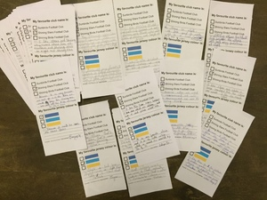
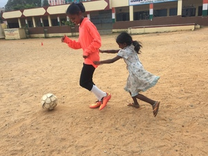
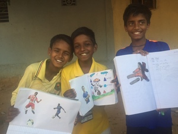
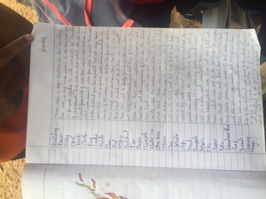
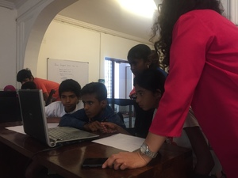
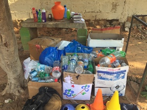
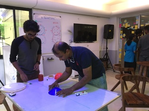

    

        

            
            
<b>Exercise #1</b>: Co-Designing our football club

        

        

        
            
<b>Exercise #2</b>: Practice makes perfect

        

        

        
            
<b>Exercise #3</b>: Document the love

        

        

        
            
<b>Exercise #4</b>: Play together, study together

        

    

    

        

        
            
<b>Exercise #5</b>: Digital literacy through Football

        

        

        
            
<b>Exercise #6</b>: Recycle for Football

        

        

        
            
<b>Exercise #7</b>: Maximising a child’s sporting potential (SportsQ)

        

        

        <a href="exercise8"></a>
            
<b>Exercise #8</b>: Adults need to play, too (Jaaga)

        

    

